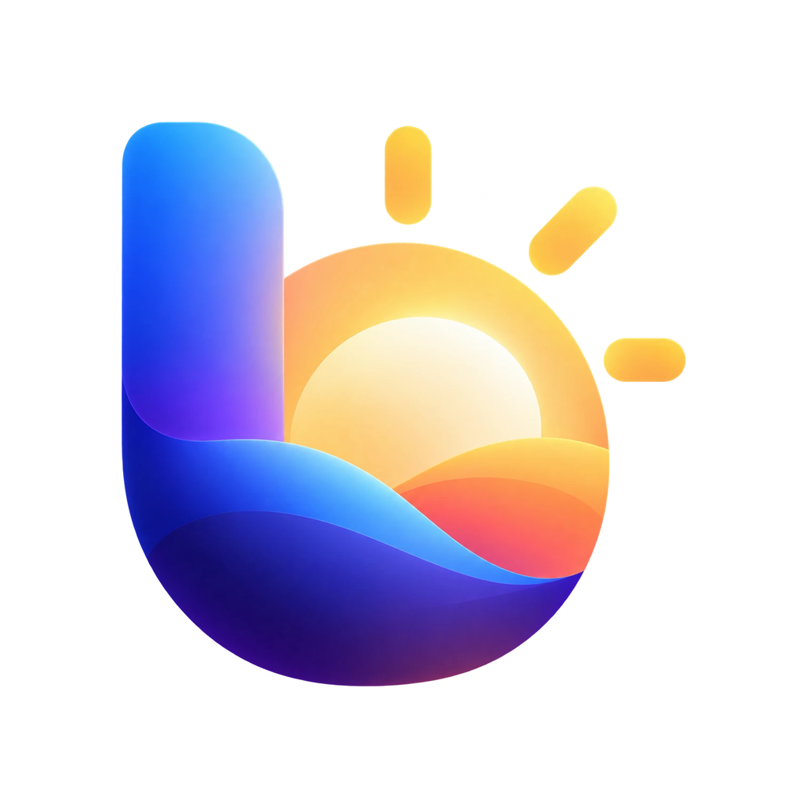
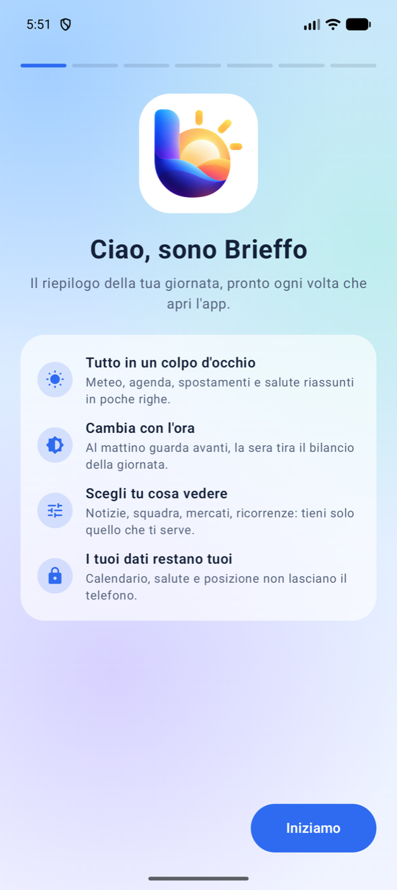
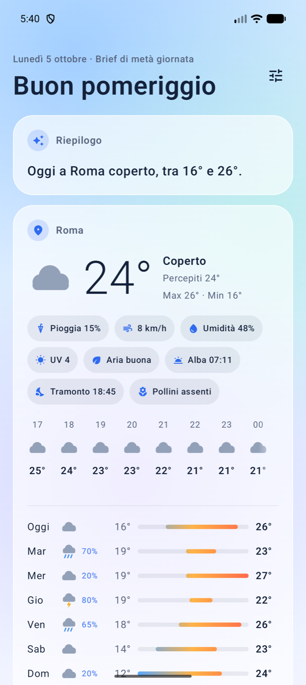
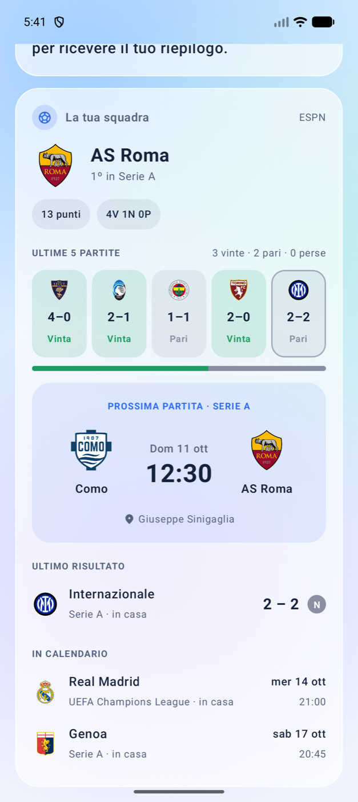
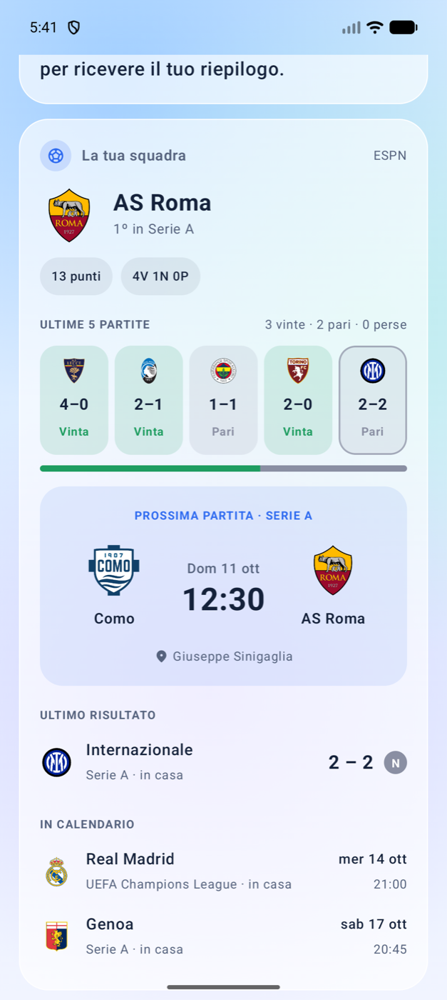

<div align="center">



# Brieffo

### Il riepilogo della tua giornata, quando ti serve.

Meteo, agenda, spostamenti, salute, notizie e la tua squadra in un'unica schermata
che cambia con l'ora del giorno.

**Android 9 o successivo · Gratuita · Senza pubblicità · Senza account**

</div>

<p align="center">
  
  
  
  
  
</p>

---

## Cos'è

Brieffo apre la giornata con poche righe che dicono quello che conta adesso: che tempo fa,
cosa hai in agenda, quando devi partire. Sotto il riepilogo trovi le schede con i dettagli,
nell'ordine più utile per quel momento.

- **Al mattino** guarda avanti: meteo, spostamenti, impegni.
- **Nel pomeriggio** mette in cima quello che ti resta da fare.
- **La sera** tira il bilancio: passi, tempo al telefono, e uno sguardo a domani.

Anche i colori seguono l'ora: chiari e caldi al mattino, scuri e profondi la sera.

## Cosa trovi nel brief

| Scheda | Cosa mostra |
| --- | --- |
| **Riepilogo** | Due o tre frasi sulla tua giornata. Composte dall'app oppure, se vuoi, scritte da Gemini. |
| **Meteo** | Condizioni attuali, prossime ore e 7 giorni. Pioggia, vento, umidità, UV, qualità dell'aria, alba e tramonto. |
| **Allerte meteo** | Allerte gialle, arancioni e rosse per la tua regione (solo Italia). |
| **Pollini** | Graminacee, betulla, ontano, olivo, artemisia e ambrosia, quando presenti. |
| **Agenda** | Impegni di oggi e domani dai calendari che scegli tu. |
| **Spostamenti** | Tempo e distanza verso il lavoro e verso il prossimo impegno, con l'ora entro cui partire. |
| **Salute e attività** | Passi con obiettivo, sonno, battito, calorie e distanza da Health Connect. |
| **Tempo di utilizzo** | Quanto sei stato al telefono oggi e su quali app. |
| **Notizie** | Titoli e foto dai siti che scegli tu: aggiungi un sito o un feed RSS e Brieffo lo legge. |
| **La tua squadra** | Classifica, ultime cinque partite, prossima gara, ultimo risultato e calendario. |
| **Mercati** | Bitcoin, Ethereum e cambi dell'euro. |
| **Ricorrenze** | Santi del giorno, compleanni dei contatti, prossima festività. |
| **In breve** | Fase lunare, batteria, prossima sveglia e un "accadde oggi". |

Ogni scheda si può nascondere. Quelle spente non scaricano dati.

## Pensata per essere tua

- **Presentazione guidata** al primo avvio: nome, città, permessi, schede, squadra e notifica in sette passi, tutti facoltativi.
- **Calendari a scelta**: accendi solo quelli che vuoi vedere, compresi quelli che Android non scarica da solo.
- **Ricerca della squadra** con campionato, per non confondere due squadre con lo stesso nome.
- **Notifica giornaliera** con il riepilogo, all'ora che decidi.
- **Icone disegnate su misura** per il meteo e la fase lunare.

## Riepilogo con l'intelligenza artificiale

Il riepilogo funziona da subito, senza rete e senza chiavi: lo compone l'app.

Se preferisci un testo più naturale, puoi collegare **Gemini** con una chiave gratuita di Google
AI Studio. La guida passo passo è nelle impostazioni, alla voce *Riepilogo con IA*.

## I tuoi dati

- **Nessun account e nessun server di Brieffo**: l'app parla direttamente con le fonti dei dati.
- **Calendario, contatti, salute e tempo di utilizzo restano sul telefono.**
- **La posizione** viene arrotondata a circa un chilometro e usata per meteo, allerte e percorsi.
- **Sola lettura**: Brieffo non crea né modifica eventi, e non scrive dati di salute.
- **Con Gemini attivo** meteo, titoli degli impegni e dati di attività vengono inviati a Google
  per scrivere il riepilogo. Senza chiave non viene inviato nulla di tutto questo.

### Permessi

Sono tutti facoltativi: ciò che non consenti resta semplicemente vuoto.

| Permesso | A cosa serve |
| --- | --- |
| Posizione approssimativa | Meteo, allerte e tempi di spostamento |
| Calendario (lettura) | Impegni di oggi e domani |
| Calendario (modifica) | Solo per chiedere ad Android di scaricare i calendari che accendi |
| Contatti | Compleanni in arrivo |
| Notifiche | Brief giornaliero |
| Health Connect | Passi, sonno, battito, calorie, distanza |
| Accesso ai dati di utilizzo | Tempo passato al telefono |

## Installazione

Brieffo non è sul Play Store: si installa dal file APK.

1. Copia `Brieffo.apk` sul telefono e aprilo.
2. Consenti l'installazione da questa origine quando Android lo chiede.
3. Apri l'app e segui la presentazione.

> **Tempo di utilizzo:** Android blocca questo accesso alle app installate da file.
> Per sbloccarlo apri *Info app* di Brieffo, tocca i tre puntini in alto a destra e scegli
> *Consenti impostazioni con limitazioni*.

## Compilare da sé

Serve [Android Studio](https://developer.android.com/studio) installato su un Mac.

| Script | Cosa fa |
| --- | --- |
| `Genera APK.command` | Doppio click: compila e crea `Brieffo.apk` nella cartella del progetto |
| `Installa sul telefono.command` | Doppio click: compila e installa sul telefono collegato via USB con Debug USB attivo |

In alternativa, da terminale:

```bash
./gradlew :app:assembleRelease
```

L'app è scritta in Kotlin con Jetpack Compose.

## Limiti da conoscere

- **Allerte meteo** disponibili solo per l'Italia, a livello di regione.
- **Tempi di spostamento** stimati senza traffico in tempo reale.
- **Luoghi vaghi negli impegni** (per esempio "Ufficio") possono dare percorsi imprecisi: serve un indirizzo.
- **Squadre**: copertura ottima per calcio e sport americani, parziale per basket e pallavolo italiani.
- **Calendari** non ancora scaricati sul telefono compaiono solo dopo che Android li ha sincronizzati.
- **Fase lunare** calcolata con una formula approssimata: può scostarsi di circa un giorno.

## Fonti dei dati

Brieffo usa solo servizi gratuiti.

| Dato | Fonte |
| --- | --- |
| Meteo, qualità dell'aria, pollini | [Open-Meteo](https://open-meteo.com) |
| Allerte meteo | [MeteoAlarm](https://meteoalarm.org) |
| Notizie | I feed RSS/Atom aggiunti dall'utente (l'app non ne include nessuno) |
| Percorsi e indirizzi | [OpenStreetMap](https://www.openstreetmap.org) |
| Sport | ESPN, [TheSportsDB](https://www.thesportsdb.com) |
| Cambi | [Frankfurter](https://frankfurter.dev) (dati BCE) |
| Criptovalute | [CoinGecko](https://www.coingecko.com) |
| Santi e "accadde oggi" | [Wikipedia](https://it.wikipedia.org) |
| Festività | [Nager.Date](https://date.nager.at) |

Titoli, foto e stemmi appartengono ai rispettivi proprietari.
